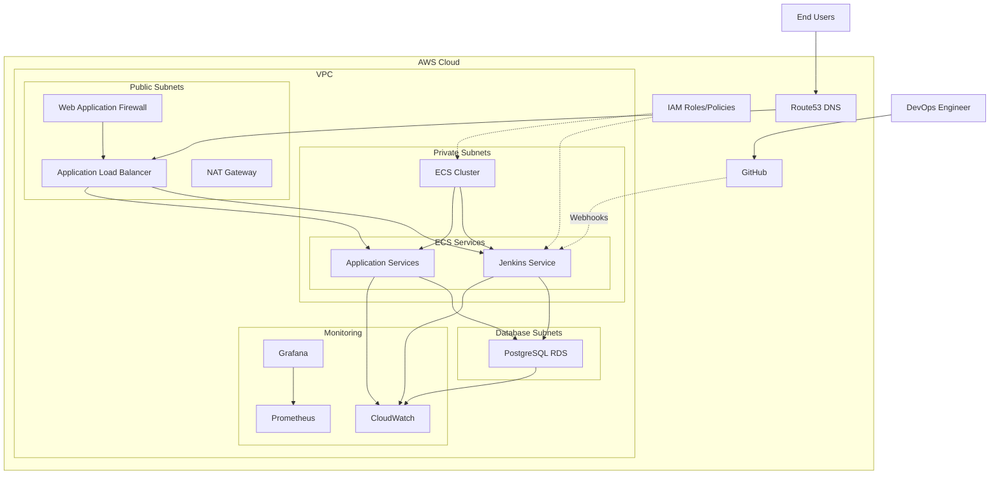

# ECS Jenkins GitHub CDK Project

This project is a CDK implementation of the ECS Jenkins with GitHub integration infrastructure, replicating the functionality of the original Terraform implementation. It creates a secure, scalable Jenkins CI/CD environment running on AWS ECS with GitHub integration, complete with monitoring, security controls, and proper networking.

> **Note for Terraform Users**: If you're familiar with Terraform and new to CDK, check out the [USAGE.md](./USAGE.md) file for a guide specifically designed for Terraform users.

## Architecture

The infrastructure consists of the following components:

- **VPC and Network**: VPC with public, private, and database subnets across multiple availability zones, NAT Gateway, Internet Gateway.
- **ECS**: ECS Cluster, Task Definitions, Services running containerized applications.
- **Security**: WAF with OWASP Top 10 protections, Security Groups, and IAM roles with least privilege.
- **Database**: RDS PostgreSQL instance in a private subnet.
- **CI/CD**: Jenkins server for continuous integration and delivery, integrated with GitHub.
- **Monitoring**: Prometheus and Grafana for monitoring and visualization.
- **Route53**: DNS configuration for the application.

### Architecture Diagram



### Deployment Flow

1. **Network Layer**: VPC, subnets, route tables, internet gateway, NAT gateway
2. **Security Layer**: Security groups, IAM roles and policies, WAF configuration
3. **Database Layer**: RDS PostgreSQL instance in private subnet
4. **Compute Layer**: ECS cluster, task definitions, and services
5. **CI/CD Layer**: Jenkins server configuration and GitHub integration
6. **Monitoring Layer**: Prometheus and Grafana setup
7. **DNS Layer**: Route53 records for public access

## Project Structure

The project is organized as a set of CDK constructs:

- `bin/cdk-projects.ts`: Entry point for the CDK application
- `lib/ecs-jenkins-github-stack.ts`: Main stack that composes all constructs
- `lib/constructs/network/`: Network infrastructure components
  - VPC configuration with public, private, and database subnets
  - Internet Gateway and NAT Gateway for outbound traffic
  - Security Groups for network isolation
- `lib/constructs/ecs/`: ECS cluster, services, and tasks
  - ECS Cluster configuration
  - Task Definitions for Jenkins and applications
  - Autoscaling policies for ECS services
- `lib/constructs/database/`: RDS database configuration
  - PostgreSQL RDS instance in private subnet
  - Database security and parameter groups
- `lib/constructs/security/`: WAF, Security Groups, and security configurations
  - Web Application Firewall (WAF) with OWASP Top 10 protections
  - Security Groups for network access control
  - AWS Config Rules for compliance monitoring
- `lib/constructs/cicd/`: Jenkins server and CI/CD pipeline components
  - Jenkins controller running on ECS
  - Integration with GitHub for source code management
  - Pipeline configuration for automated builds and deployments
- `lib/constructs/monitoring/`: Prometheus and Grafana monitoring setup
  - Prometheus for metrics collection
  - Grafana for visualization and dashboards
  - CloudWatch for logs and alarms
- `lib/constructs/iam/`: IAM roles and policies
  - Access control for ECS tasks and services
  - Service roles with least privilege principles
- `lib/constructs/route53/`: DNS configuration
  - Public DNS records for services
  - DNS health checks for high availability

## Deployment

### Prerequisites

- AWS CLI configured with appropriate credentials
- Node.js and npm installed
- AWS CDK installed (`npm install -g aws-cdk`)

### Bootstrap CDK (first time only)

```bash
cdk bootstrap aws://ACCOUNT-NUMBER/REGION
```

### Deploy the Stack

```bash
# Set environment variables for sensitive information
export DB_USERNAME=your_db_username
export DB_PASSWORD=your_db_password
export GRAFANA_ADMIN_PASSWORD=your_grafana_password

# Required environment variables
export DB_USERNAME=your_db_username
export DB_PASSWORD=your_db_password
export GRAFANA_ADMIN_PASSWORD=your_grafana_password

# Deploy the development stack
cdk deploy EcsJenkinsGithubDevStack
```

## Configuration

The main configuration is in `bin/cdk-projects.ts`. You can modify the parameters for each environment:

- Network configurations (VPC CIDR, subnet CIDRs)
- Instance types and capacities
- Database credentials (should use environment variables or AWS Secrets Manager for production)
- OWASP security settings

## OWASP Security Features

This project incorporates several OWASP security best practices:

- WAF with OWASP Top 10 protections
- Rate limiting to prevent DDoS attacks
- Input validation and SQL injection prevention
- XSS protection
- Security headers on all HTTP responses
- Encrypted data at rest and in transit
- Least privilege IAM policies

### Security and Compliance Scanning

The project includes integration with `cdk-nag` to scan for security issues and compliance:

```bash
# Build and scan for security issues
npm run build
cdk synth  # Security scan results will be in the output
```

ESLint is also configured for code quality and security best practices:

```bash
# Run linting
npm run lint
```

## Differences from Terraform Implementation

The CDK implementation follows the same architecture and provides the same functionality as the Terraform implementation, but with a few differences:

- CDK uses AWS CloudFormation under the hood, which may result in slightly different resource creation order
- CDK's programming model allows for more abstraction and reuse of code
- Some AWS-specific features are implemented differently due to CDK's constructs design.

## Useful Commands

* `npm run build` - Compile TypeScript to JavaScript
* `npm run watch` - Watch for changes and compile
* `npm run test` - Run the Jest unit tests
* `npm run lint` - Run code linting and security checks
* `cdk deploy` - Deploy the stack to your AWS account
* `cdk diff` - Compare deployed stack with current state
* `cdk synth` - Emit the synthesized CloudFormation template
* `cdk destroy` - Remove all resources from AWS

## CI/CD Workflow

This project includes a Jenkinsfile that defines the CI/CD pipeline workflow:

1. **Source**: Code is pulled from GitHub repository
2. **Build**: TypeScript is compiled to JavaScript
3. **Test**: Unit tests are run
4. **Security Scan**: Code is scanned for vulnerabilities
5. **Plan**: CDK diff is generated to preview changes
6. **Deploy**: CDK stack is deployed to AWS (requires approval for production)
7. **Post-deployment Tests**: Validates the deployed infrastructure

## Extending the Project

### Adding a New Service

To add a new service to the ECS cluster:

1. Create a new construct in the appropriate directory (e.g., `lib/constructs/ecs/new-service.ts`)
2. Define the task definition, service, and any required resources
3. Import and instantiate the construct in the main stack (`lib/ecs-jenkins-github-stack.ts`)
4. Deploy the updated stack

### Modifying Security Rules

Security groups and WAF rules can be modified in the security constructs:

- Update WAF rules in `lib/constructs/security/waf-construct.ts`
- Modify security groups in the relevant service constructs

## Required Environment Variables

This project requires the following environment variables to be set before deployment:

### Development Environment
- `DB_USERNAME`: Database administrator username
- `DB_PASSWORD`: Database administrator password
- `GRAFANA_ADMIN_PASSWORD`: Password for Grafana admin user

### Production Environment
- `PROD_DB_USERNAME`: Production database administrator username
- `PROD_DB_PASSWORD`: Production database administrator password
- `PROD_GRAFANA_ADMIN_PASSWORD`: Password for production Grafana admin user

**Important:** Never commit actual credentials to your repository. Use environment variables or AWS Secrets Manager for sensitive information.